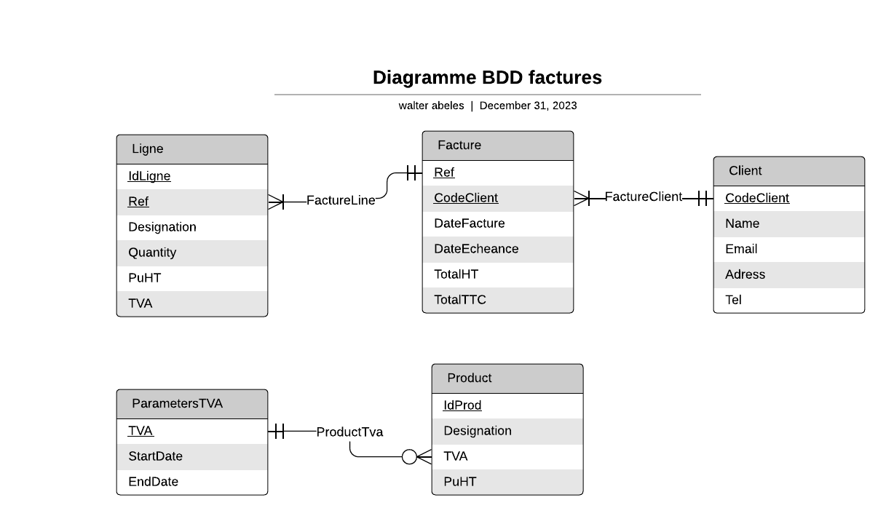

# Exercice Okayo #
Le but de cet exercice est de décrire le modèle de données relationnel qui serait lié à la gestion de factures. Il s’agit de créer des factures, les stocker et pouvoir les visualiser en détail. Pour cela on doit pouvoir traiter des paramètres qui seraient préalablement stockés (taux de TVA sur une période
donnée, base client, base catalogue des éléments désignés en ligne sur les factures, ...).

Pour cela on fait les hypothèses suivantes :
- Une fois la facture établie à une date donnée, et à chaque consultation, le TTC devra être
systématiquement le même, indépendamment des évolutions de tarif des produits du catalogue.
- Les noms et les prix des prestations pourront éventuellement évoluer dans le catalogue, mais doivent
être évidemment rester inchangés sur les factures déjà existantes
- La TVA peut changer au fur et à mesure du temps et peut être différente pour chaque produit du
catalogue. Il est possible que celle-ci doive évoluer à une date précise ou pour une période donnée.

## Base de données ##
J'ai choisi de créer ma base de données selon le schéma relationnel suivant :

Les associations entre les différentes tables sont modélisés sous forme de tables contenant les clés étrangères des deux entités associées. Cela donne la base de données suivante :

La table Client permet de stocker les informations de chaque client. Un client peut avoir 0 à n factures et chaque facture est associé à un unique client. 
Une facture est caractérisée par sa référence, ses dates d'écheance et de réalisation, son prix total en HT et en TTC. Les prix totals en TH et TTC sont calculés en sommant les prix HT et TTC de chaque ligne.
Une ligne correspond à un produit commandé par le client, elle contient sa désignation, son prix unitaire HT, sa quantité, le taux de tva affecté au produit au moment de l'achat et la référence de la facture. Chaque ligne est associé à une unique facture et chaque facture contient 1 à n lignes.
Chaque produit est caractérisé par sa désignation, son prix unitaire HT et la TVA qui lui est associée. Chaque TVA est caractérisé par sa valeur et ses dates de début et fin de validité. Un produit se voit associé une unique TVA et chaque TVA peut être attribuée à 0 à n produits.

## API de visualtion ##
J'ai réalisé une petite API très simple permettant de parcourir un catalogue de produits, les ajouter et les retirer d'un panier, de soumettre ce panier pour générer une facture.
L'API est réalisé en Java Spring avec les bibliothèques Thymeleaf, JPA, Lombok et JodaTime. Il s'agit d'une esquisse seulement réalisé dans le but de tester le fonctionnement de cette base de données, elle est bien évidemment améliorable en beaucoup de points.

### Installation ###
Il faut démarrer un serveur MySQL pour que l'API se connecte à la base. L'url, le nom d'utilisateur et le mot de passe du serveur doivent être rentrés dans le fichier application.properties localisé dans le dossier src/main/ressources/

### Démarrage ###
Sur un framework de type VS Code, IntelliJ ou Eclipse il suffit d'ouvrir le repo, de build le projet et de le run. 
Lors du premier démarrage veuillez à décommenter les lignes présentes dans la fonction run() du fichier OkayoApplication.java situé dans le dossier src/main/java/com/example/okayo pour générer la base donnée avec des instances de produits, tva et client.